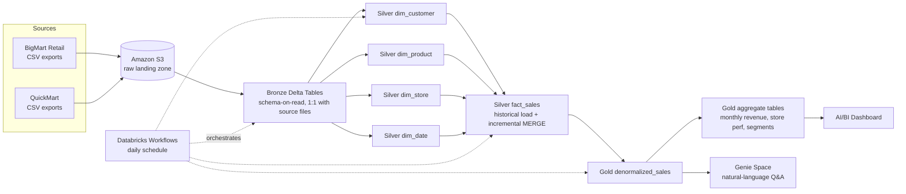

# Architecture

## Business context
BigMart Retail (a large FMCG retail chain) has acquired QuickMart (a smaller
regional chain). Leadership needs one consolidated view of sales,
customers, products, and stores across both businesses — for finance
reporting, category management, and store-performance comparisons — within
90 days of deal close.

## Tech architecture

## Why Databricks Free Edition works for this
- Unity Catalog (catalog/schema/table governance) is included.
- Delta Lake MERGE gives idempotent, re-runnable incremental loads.
- Serverless SQL Warehouses power the dashboard without managing clusters.
- Genie Spaces ship out of the box — no extra BI licensing needed for
  stakeholder self-service.
- Databricks Workflows (Jobs) provide free orchestration with task
  dependencies, retries, and failure alerting.

## Two learning paths
1. **Beginner path**: run each notebook manually, in order (00 → 09),
   inspecting each table as you go.
2. **Advanced path**: import `notebooks/orchestration_job.json` as a
   Databricks Workflow and let it run end-to-end on a schedule; focus on
   the MERGE/incremental logic in `src/utils/scd_utils.py` and the data
   quality gates in `src/utils/data_quality.py`.
