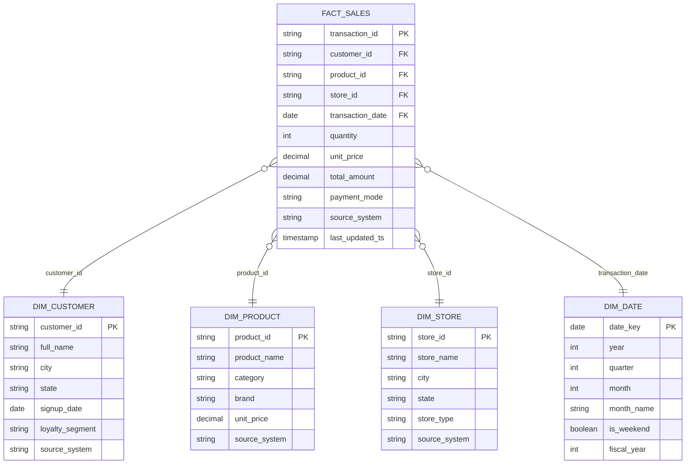

# Data Model

Star schema, grain of `fact_sales` = one row per sales transaction line.

## Why `source_system` is on every table
Since this is an acquisition-integration project, every conformed table
carries a `source_system` column (`BigMart Retail` vs `QuickMart`). This
lets analysts and Genie answer both "consolidated" questions (whole
company) and "pre/post-merger comparison" questions without needing
separate schemas per company.

## Medallion layers
| Layer  | Contents | Format |
|--------|----------|--------|
| Bronze | Raw as-landed CSV -> Delta, one table per source file per company | Delta, append/overwrite |
| Silver | Conformed, deduplicated, SCD-1 dimensions + merged fact table | Delta, MERGE |
| Gold   | `denormalized_sales` (Genie) + pre-aggregated KPI tables (dashboard) | Delta, CTAS |
